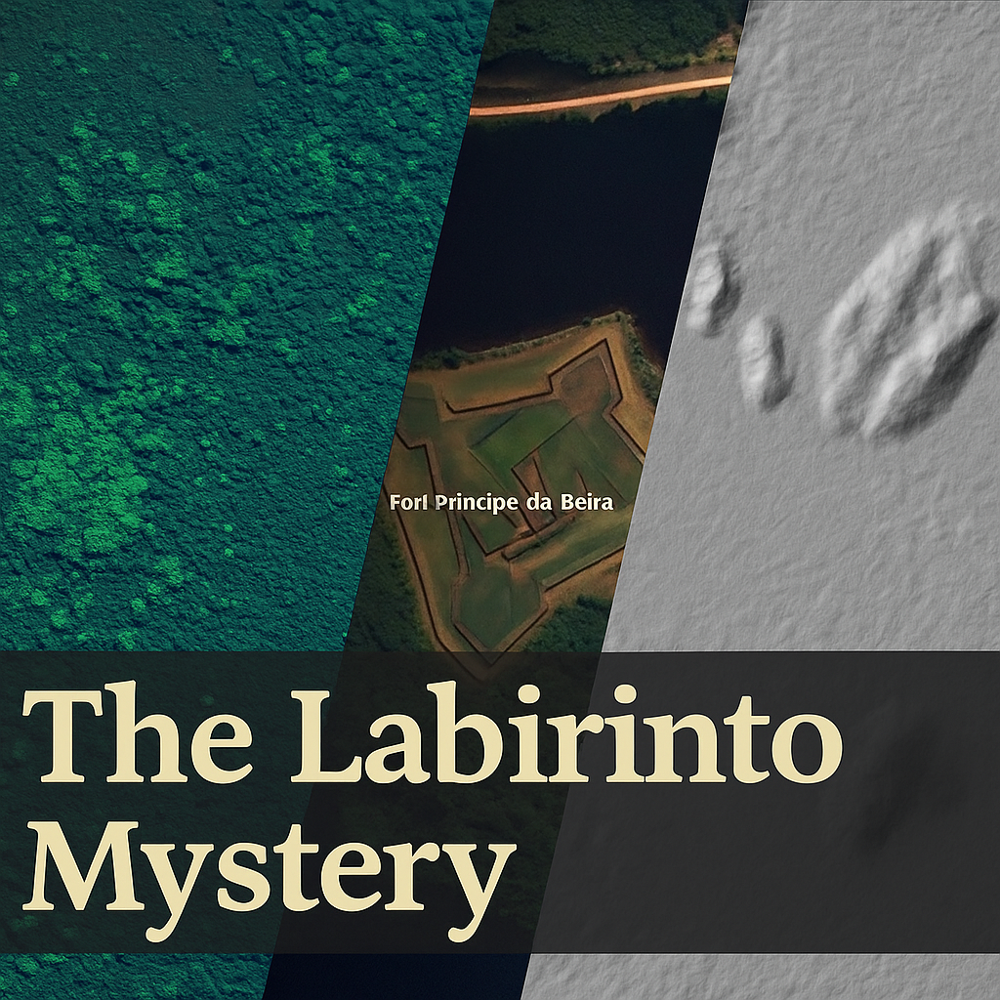
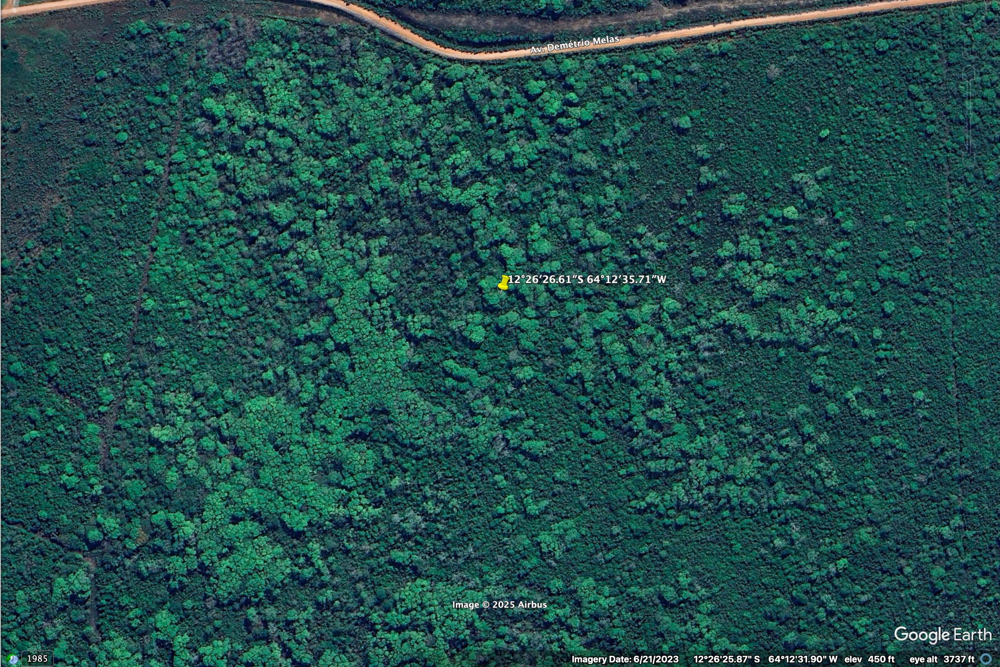
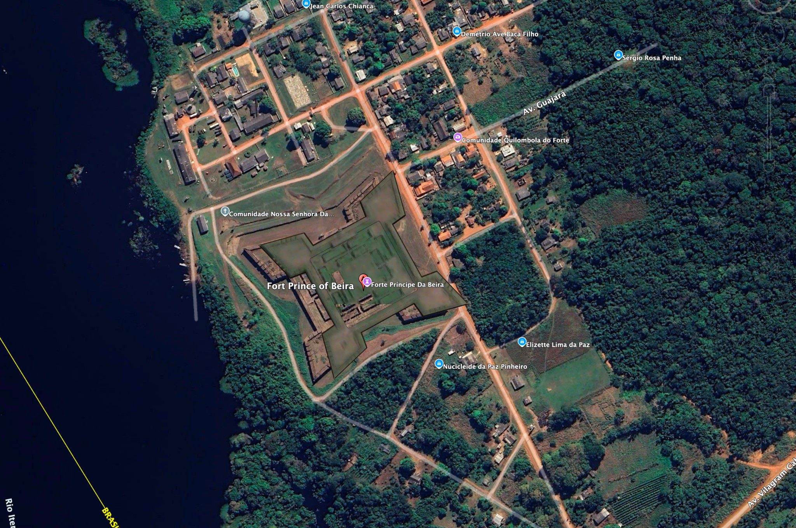
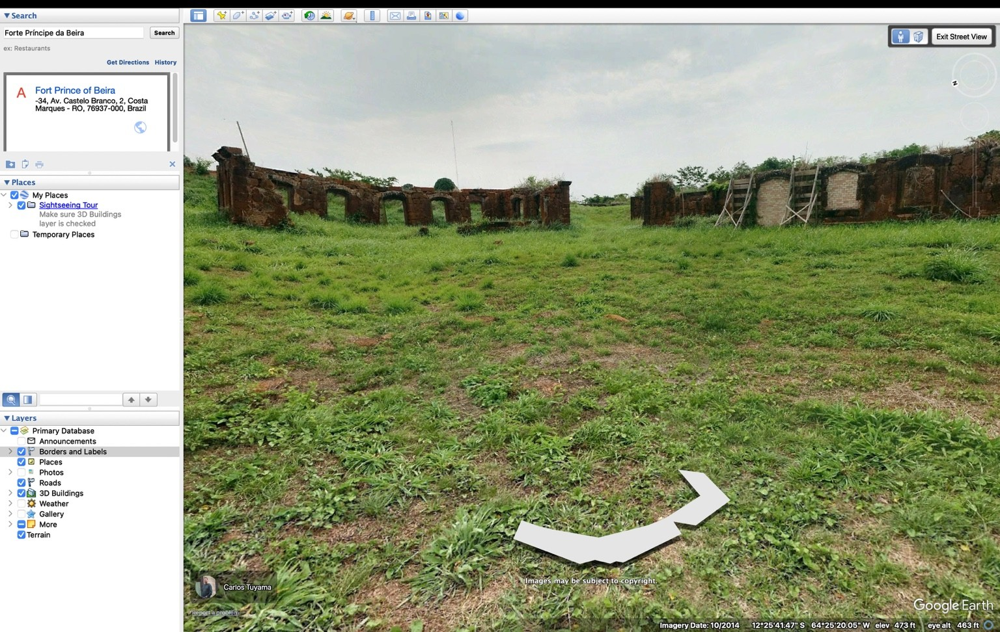
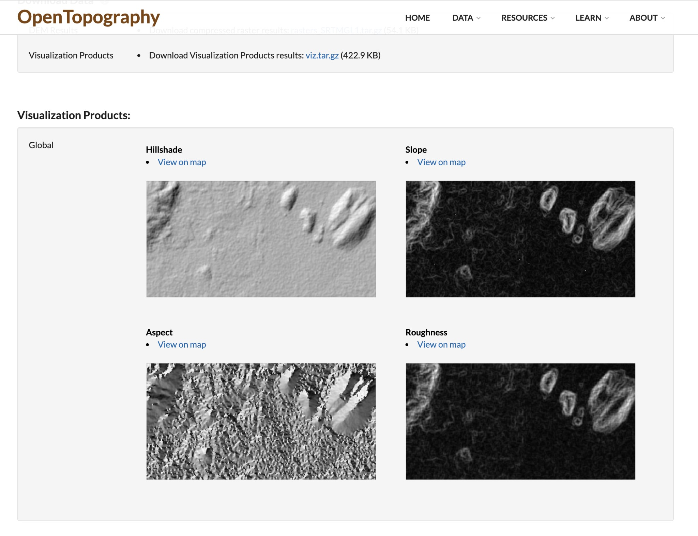
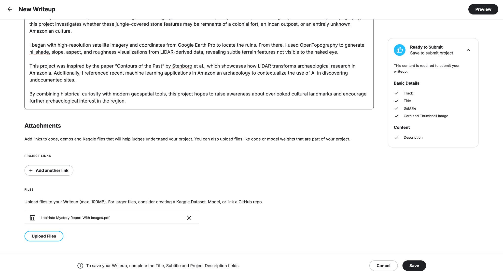

# The Labirinto Mystery: Rediscovering a Forgotten Amazonian Ruin

**OpenAI to Z Challenge — Kaggle**

An AI-assisted geospatial investigation of a mysterious jungle-covered site near Costa Marques, Rondônia, Brazil, using satellite imagery, historical research, and terrain analysis.

## Project Overview

The Labirinto Mystery investigates unusual stone features near the Labirinto da Bahia Redonda region in Rondônia, Brazil.

The project explores whether these jungle-covered features could be connected to a colonial fort, an Indigenous or pre-Columbian site, or another undocumented historical structure.

Rather than claiming the site has been identified, the project uses modern geospatial tools to examine the landscape and document features that may deserve further investigation.

## Location Investigation

Google Earth imagery was used to examine the suspected location and surrounding terrain.

The coordinates investigated were approximately:

**12°26'26.61"S, 64°12'35.71"W**

The satellite imagery shows dense vegetation surrounding the target area, making conventional visual inspection difficult.

## Historical Comparison

The investigation also examined **Forte Príncipe da Beira**, an established Portuguese colonial fort in Rondônia, as a historical and geographic comparison.

A ground-level view provides additional context for the surviving architecture of the fort.

The fort serves as a reference point rather than proof that the Labirinto site has the same origin.

## Terrain Analysis

To look beyond what is easily visible in satellite imagery, terrain data was explored using **OpenTopography**.

Four visualization products were examined:

- **Hillshade** — emphasizes terrain relief using simulated illumination.
- **Slope** — highlights changes in terrain steepness.
- **Aspect** — represents the orientation of terrain surfaces.
- **Roughness** — highlights variation and irregularity in the terrain.

These visualizations help expose terrain patterns that may be difficult to recognize beneath dense vegetation using ordinary satellite imagery alone.

## Research Approach

The project followed a simple investigative workflow:

**Historical clue → Geographic localization → Satellite inspection → Terrain analysis → Comparison → Interpretation**

The research was also informed by archaeological work demonstrating the usefulness of LiDAR and machine-learning techniques for identifying archaeological features in Amazonia.

AI was used as a research assistant to help organize the investigation, interpret technical concepts, compare evidence, and develop hypotheses. It was not treated as proof of the site's identity.

## Findings

The investigation demonstrated that combining satellite imagery, terrain visualization, historical research, and AI-assisted analysis can provide a useful way to examine difficult-to-access landscapes.

However, the available remote-sensing evidence alone cannot establish the age, origin, or purpose of the Labirinto features.

Confirming their archaeological significance would require stronger datasets and professional archaeological investigation.

## Project Media

The repository contains the primary visual evidence used in the investigation:

1. Suspected Labirinto location — Google Earth
2. Forte Príncipe da Beira — satellite view
3. Forte Príncipe da Beira — ground view
4. OpenTopography terrain visualizations
5. Project thumbnail
6. Kaggle submission screenshot

## Challenge Submission

This project was developed for the **OpenAI to Z Challenge** and submitted as a Kaggle Writeup.

## Tools Used

- Google Earth Pro
- OpenTopography
- LiDAR-derived terrain data
- Satellite imagery
- AI-assisted research and analysis
- Kaggle

## Author

**Sujal Jani**  
Computer Science — Suffolk University
